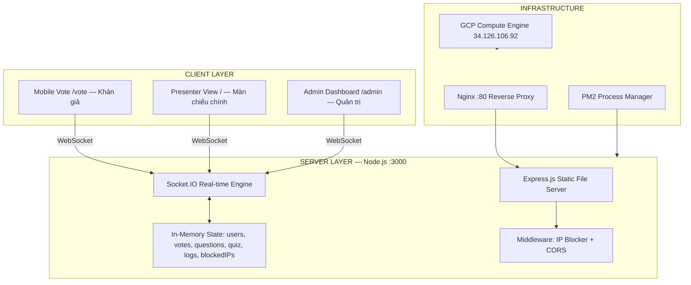
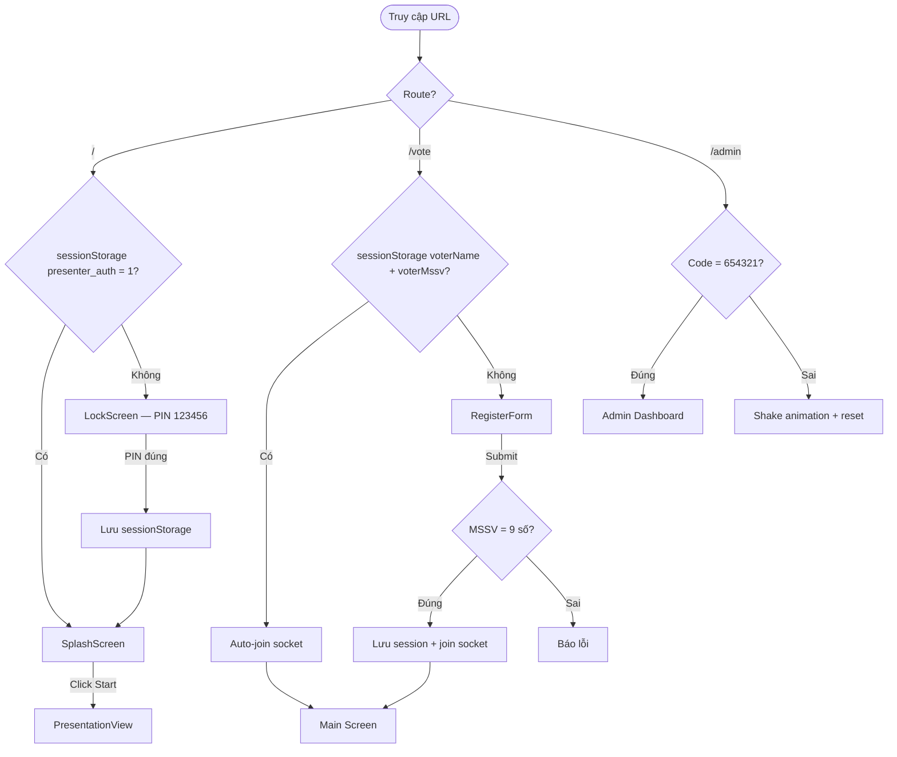
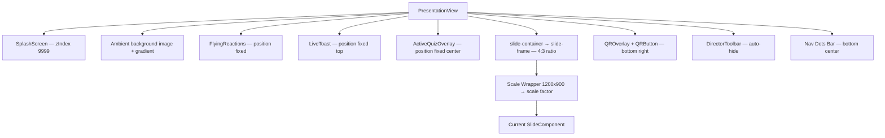
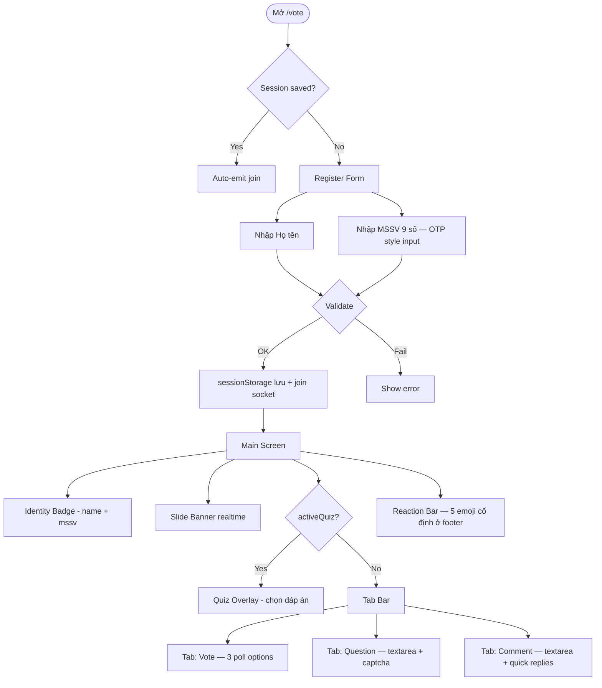
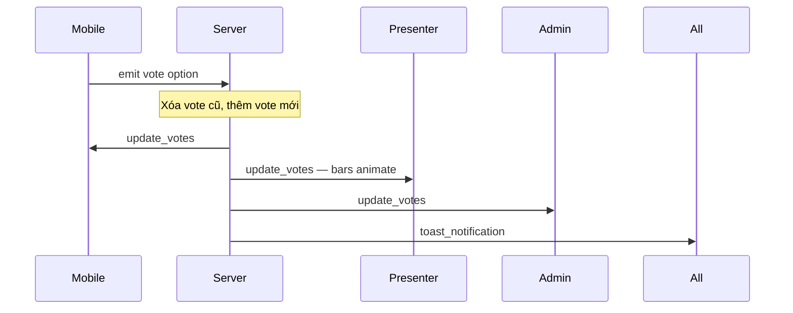
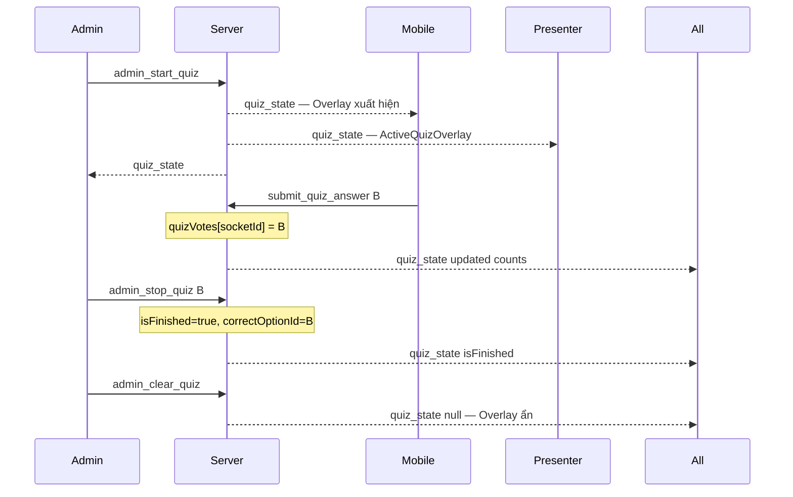
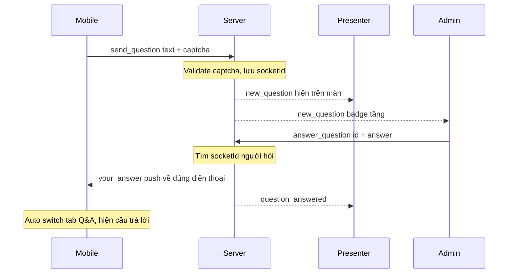
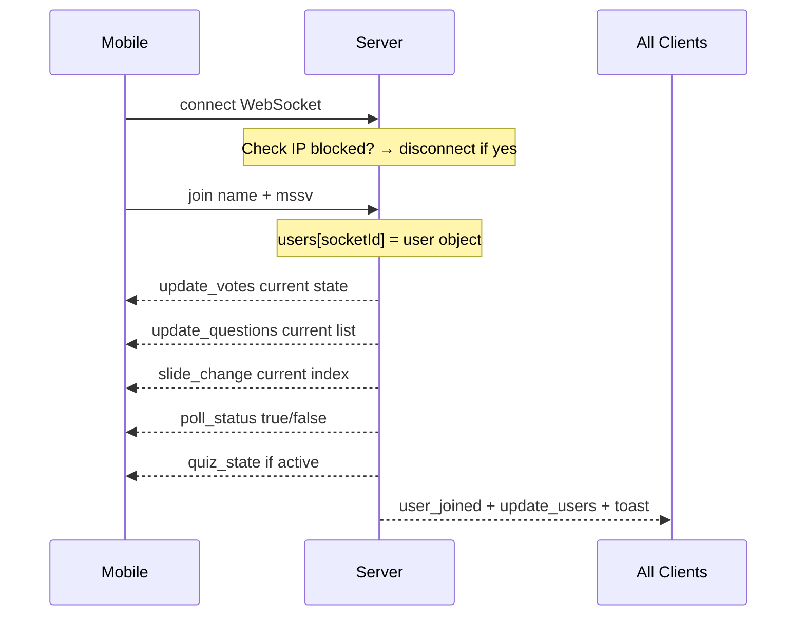
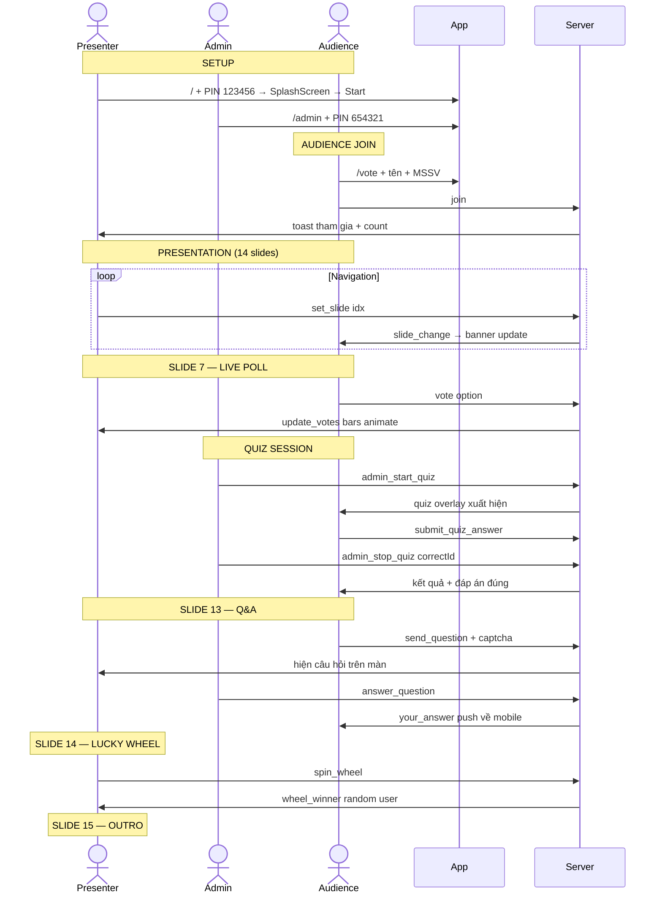

# TTHCM — Hệ Thống Thuyết Trình Tương Tác Trực Tiếp
## Tài Liệu Kỹ Thuật Toàn Diện (AI-Reproducible Specification)

> **Mục đích:** Tài liệu này mô tả toàn bộ kiến trúc, nghiệp vụ, API và luồng hoạt động của hệ thống đủ chi tiết để một AI có thể tái tạo lại từ đầu.

---

## 1. TỔNG QUAN HỆ THỐNG

### 1.1 Mô tả
Hệ thống **TTHCM Interactive Presentation** là một nền tảng thuyết trình trực tuyến thời gian thực, được thiết kế cho buổi báo cáo học thuật môn Tư Tưởng Hồ Chí Minh (SSH1151). Hệ thống cho phép khán giả tương tác trực tiếp với màn chiếu thông qua điện thoại cá nhân.

### 1.2 Đặc điểm nổi bật
- **Real-time bidirectional**: Mọi tương tác của khán giả phản ánh tức thì lên màn chiếu
- **Multi-device**: Màn chiếu presenter + điện thoại khán giả + admin dashboard
- **Slide system**: 14 slides với 8 loại layout khác nhau
- **Gamification**: Flip cards, roleplay, lucky wheel, live quiz, biểu quyết
- **Security**: Lock screen PIN, captcha chống spam, IP blocking, rate limiting, bad word filter

### 1.3 Tech Stack

| Layer | Công nghệ |
|-------|-----------|
| Frontend | React 18 + Vite 8 |
| Animation | Framer Motion |
| Real-time | Socket.IO (WebSocket) |
| Backend | Node.js + Express |
| Process Manager | PM2 |
| Reverse Proxy | Nginx |
| Hosting | Google Cloud Platform (Compute Engine) |
| QR Code | qrcode.react |
| Font | Google Fonts: Playfair Display + Inter |

---

## 2. KIẾN TRÚC HỆ THỐNG

### 2.1 Sơ đồ tổng thể



### 2.2 Cấu trúc thư mục

```
DS-PRJ/
├── Dockerfile
├── docker-compose.yml
├── deploy.sh                     # Build + SCP + PM2 restart
└── tthcm-app/
    ├── package.json
    ├── server.js                 # Backend: Express + Socket.IO
    └── src/
        ├── App.jsx               # Router: /, /vote, /admin
        ├── index.css             # Design system (CSS variables)
        ├── slides.js             # Dữ liệu 14 slides
        ├── PresentationView.jsx  # Màn chiếu presenter
        ├── routes/
        │   ├── LockScreen.jsx    # PIN gate presenter
        │   ├── MobileVote.jsx    # Giao diện khán giả
        │   └── AdminDashboard.jsx
        └── components/
            ├── SplashScreen.jsx
            ├── VotingBoard.jsx
            ├── QABoard.jsx
            ├── LuckyWheel.jsx
            ├── DynamicEnding.jsx
            ├── FlyingReactions.jsx
            ├── LiveToast.jsx
            ├── DirectorToolbar.jsx
            ├── DeepFlipCard.jsx
            └── slides/
                ├── SlideTitle.jsx
                ├── SlideFlipCards.jsx
                ├── SlideRoleplay.jsx
                ├── SlideGeoLayout.jsx
                ├── SlideBamboo.jsx
                ├── SlideLessons.jsx
                └── SlideOutro.jsx
```

---

## 3. AUTHENTICATION & SECURITY

### 3.1 Luồng xác thực



### 3.2 Mã PIN

| Role | URL | Mã |
|------|-----|----|
| Presenter | `/` | `123456` |
| Admin | `/admin` | `654321` |

### 3.3 Anti-spam & Security
- **Rate limiting**: Reaction 800ms / Comment 3000ms cooldown per socket
- **Captcha**: 3-digit code khi gửi câu hỏi
- **Bad word filter**: 20+ từ tiếng Việt (regex)
- **IP Blocking**: Admin block/unblock, immediate disconnect
- **Content limit**: Comment ≤200 ký tự, câu hỏi ≤300 ký tự

---

## 4. BACKEND — SERVER.JS

### 4.1 State (In-Memory)

```javascript
let users        = {};   // { socketId: { name, mssv, email, ip } }
let votes        = { 'Tổng lực': [], 'Giới hạn': [], 'Hòa bình': [] };
let questions    = [];   // [{ id, name, mssv, socketId, text, answer, verifyCode }]
let currentSlide = 0;
let pollActive   = true;
let blockedIPs   = new Set();
let logs         = [];   // tối đa 500 mục, LIFO

let activeQuiz   = null; // { question, options[], isFinished, correctOptionId, counts, totalVotes }
let quizVotes    = {};   // { socketId: optionId }

const RATE_MS = { reaction: 800, message: 3000 };
server.listen(process.env.PORT || 3000, '0.0.0.0');
```

### 4.2 Toàn bộ Socket.IO Events

#### Từ Client → Server

| Event | Payload | Mô tả | Ai gửi |
|-------|---------|--------|--------|
| `join` | `{ name, mssv, email }` | Đăng ký tham gia | Khán giả |
| `vote` | `{ option: string }` | Bỏ phiếu poll (1 phiếu/người, đổi được) | Khán giả |
| `send_reaction` | `emoji: string` | Gửi emoji reaction (rate-limited) | Khán giả |
| `send_message` | `text: string` | Gửi bình luận live (rate-limited) | Khán giả |
| `send_question` | `{ text, verifyCode }` | Gửi câu hỏi có captcha | Khán giả |
| `submit_quiz_answer` | `optionId: string` | Trả lời câu hỏi trắc nghiệm | Khán giả |
| `request_users` | _(none)_ | Yêu cầu danh sách user | Bất kỳ |
| `set_slide` | `idx: number` | Chuyển slide | Presenter |
| `toggle_poll` | `active: boolean` | Bật/tắt poll | Presenter/Admin |
| `answer_question` | `{ id, answer }` | Trả lời câu hỏi | Admin |
| `spin_wheel` | _(none)_ | Quay vòng quay random | Presenter |
| `get_logs` | _(none)_ | Lấy activity log | Admin |
| `block_ip` | `ip: string` | Chặn IP | Admin |
| `unblock_ip` | `ip: string` | Bỏ chặn IP | Admin |
| `get_blocked_ips` | _(none)_ | Lấy danh sách IP bị chặn | Admin |
| `admin_start_quiz` | `{ question, options[] }` | Bắt đầu quiz | Admin |
| `admin_stop_quiz` | `correctOptionId \| null` | Chốt kết quả quiz | Admin |
| `admin_clear_quiz` | _(none)_ | Ẩn quiz | Admin |

#### Từ Server → Client

| Event | Payload | Broadcast to | Mô tả |
|-------|---------|-------------|--------|
| `user_joined` | `{ name, mssv, total }` | `io.emit` | Thông báo user mới |
| `update_users` | `User[]` | `io.emit` | Danh sách online |
| `update_votes` | `{ option: name[] }` | `io.emit` | Kết quả vote |
| `update_questions` | `Question[]` | `io.emit` | Danh sách câu hỏi |
| `new_question` | `Question` | `io.emit` | Câu hỏi mới |
| `question_answered` | `{ id, answer }` | `io.emit` | Câu hỏi được TL |
| `your_answer` | `{ question, answer }` | `io.to(socketId)` | TL riêng về điện thoại người hỏi |
| `show_reaction` | `{ emoji, name, id }` | `io.emit` | Emoji bay lên màn |
| `new_message` | `{ name, text, id }` | `io.emit` | Bình luận mới |
| `slide_change` | `idx: number` | `io.emit` | Slide thay đổi |
| `poll_status` | `active: boolean` | `io.emit` | Trạng thái poll |
| `wheel_winner` | `User` | `io.emit` | Người thắng vòng quay |
| `quiz_state` | `QuizState \| null` | `io.emit` | Trạng thái quiz realtime |
| `toast_notification` | `{ message }` | `io.emit` | Toast popup |
| `admin_logs` | `Log[]` | `socket.emit` | Activity log (chỉ admin) |
| `blocked_ips` | `string[]` | `socket.emit` | Danh sách IP bị chặn |

### 4.3 Data Models

```typescript
interface User {
  name:  string;   // Đã qua filterText()
  mssv:  string;   // 9 ký tự số
  email: string;
  ip:    string;   // x-forwarded-for
}

interface Question {
  id:         number;        // Date.now() + Math.random()
  name:       string;
  mssv:       string;
  socketId:   string;
  text:       string;        // Tối đa 300 ký tự, đã filter
  answer:     string | null;
  verifyCode: string;        // Captcha 3 số
}

interface QuizState {
  question:        string;
  options:         Array<{ id: string; text: string }>;
  isFinished:      boolean;
  correctOptionId: string | null;
  counts:          Record<string, number>;
  totalVotes:      number;
}

interface Log {
  ts:      string;  // ISO timestamp
  type:    'join' | 'vote' | 'comment' | 'question' | 'answer' | 'block';
  name?:   string;
  mssv?:   string;
  option?: string;
  text?:   string;
  ip:      string;
}
```

---

## 5. PRESENTER VIEW

### 5.1 Cấu trúc render



### 5.2 Scale-to-fit System

Slides được render ở **1200×900px** (4:3), sau đó scale down để vừa frame:

```javascript
const DESIGN_W = 1200;
const DESIGN_H = 900;

function useSlideScale(frameRef) {
  // ResizeObserver theo dõi kích thước frame thực
  // scale = min(frameWidth/1200, frameHeight/900)
  // transform: `translate(-50%,-50%) scale(${scale})`
}
```

### 5.3 Navigation
- **Keyboard**: `ArrowRight`/`Space` = next, `ArrowLeft` = prev
- **Mouse wheel**: scroll down/up (cooldown 900ms)
- **Nav dots**: Click để jump to slide
- **Socket**: `set_slide(idx)` broadcast real-time

---

## 6. SLIDE SYSTEM

### 6.1 Slide Data Structure

```javascript
// slides.js
{
  id:            string,          // 's1' → 's15'
  bg:            string | 'none', // URL ảnh nền
  type:          SlideType,       // Xác định component render
  data:          object,          // Props cụ thể
  mobileSummary: string,          // Hiển thị trên /vote
}
```

### 6.2 Type → Component Map

| Type | Component | Mô tả |
|------|-----------|--------|
| `title` | `SlideTitle` | Cover: 2 cột — content left + members right |
| `flip-cards` | `SlideFlipCards` | Grid 2–3 thẻ 3D flip (click để lật) |
| `roleplay` | `SlideRoleplay` | 4 thẻ lãnh đạo + popup nhập vai 2 lựa chọn |
| `geo-layout` | `SlideGeoLayout` | Hero block trên + 2 cột dưới |
| `bamboo-diplomacy` | `SlideBamboo` | 3 sections ngang |
| `lessons` | `SlideLessons` | 5 lesson cards với ảnh |
| `outro` | `SlideOutro` | Full-center: title + quote |
| `poll` | `VotingBoard` | Live poll realtime + progress bars |
| `dynamic-ending` | `DynamicEnding` | Kết luận thay đổi theo vote |
| `qa-board` | `QABoard` | Câu hỏi từ khán giả realtime |
| `lucky-wheel` | `LuckyWheel` | Vòng quay ngẫu nhiên |

### 6.3 Danh sách 14 Slides

| # | ID | Type | Nội dung |
|---|----|------|----------|
| 1 | s1 | title | Cover — 9 thành viên Nhóm 5 |
| 2 | s2 | flip-cards | 3 nguyên nhân: Tài nguyên, Tôn giáo, Lịch sử |
| 3 | s3 | flip-cards | Israel vs Palestine |
| 4 | s4 | flip-cards | Iran vs USA |
| 5 | s5 | roleplay | Nhập vai 4 lãnh đạo: Mỹ/Israel/Iran/Ả Rập |
| 6 | s6 | flip-cards | 3 kịch bản tương lai (20%/55%/25%) |
| 7 | s7 | poll | **Live Poll** — khán giả bỏ phiếu |
| 8 | s8 | geo-layout | Địa chính trị Việt Nam |
| 9 | s9 | bamboo-diplomacy | Ngoại giao Cây Tre |
| 10 | s10 | lessons | 5 bài học từ Trung Đông |
| 11 | s12 | dynamic-ending | **Dynamic** — kết theo vote |
| 12 | s13 | qa-board | **Live Q&A** |
| 13 | s14 | lucky-wheel | **Lucky Wheel** |
| 14 | s15 | outro | Lời kết + trích dẫn Hồ Chí Minh |

---

## 7. MOBILE VOTE (/vote)

### 7.1 User Flow



### 7.2 Poll Options
- 💥 Chiến Tranh Tổng Lực (`id: 'Tổng lực'`)
- ⚠️ Xung Đột Giới Hạn (`id: 'Giới hạn'`)
- 🕊️ Hạ Nhiệt Ngoại Giao (`id: 'Hòa bình'`)

### 7.3 Captcha System
```javascript
// 3-digit random code
const captchaCode = Math.floor(100 + Math.random() * 900).toString();
// Hiển thị: gold badge với số 3 chữ số
// User nhập: OTPInput với 3 ô
// Validate: verify !== captchaCode → reject
// Reset: new code sau mỗi lần submit
```

---

## 8. ADMIN DASHBOARD (/admin)

### 8.1 Cấu trúc 7 Tabs

| Tab | Icon | Nội dung |
|-----|------|----------|
| Tổng Quan | 📊 | Stats cards + Vote results với bars |
| Điều Khiển | 🎛️ | Zoom slider + Countdown timer + Fullscreen + QR |
| Trắc Nghiệm | 📝 | Quiz creator + Live results + Chốt đáp án |
| Hỏi & Đáp | ❓ | Q&A list + Answer panel (push về mobile) |
| Người Dùng | 👥 | Online users + Block IP button |
| IP Bị Chặn | 🚫 | Blocked list + Unblock |
| Nhật Ký | 📋 | Activity log với filter |

### 8.2 Quiz Creator Flow

```
1. Nhập câu hỏi (text)
2. Nhập A/B/C/D/E đáp án (tối đa 5)
3. Click "Phát Sóng" → admin_start_quiz
   → Quiz overlay xuất hiện trên mobile + presenter
4. Live bar chart realtime (counts update từng giây)
5. Admin chọn đáp án đúng hoặc để trống (= khảo sát)
6. Click "Chốt Kết Quả" → admin_stop_quiz(correctId)
   → Mobile hiện kết quả + highlight đáp án đúng
7. Click "Ẩn Trắc Nghiệm" → admin_clear_quiz
   → Overlay ẩn khỏi tất cả thiết bị
```

---

## 9. REAL-TIME FLOW DIAGRAMS

### 9.1 Luồng Vote



### 9.2 Luồng Quiz Realtime



### 9.3 Luồng Q&A Push



### 9.4 Luồng Join + State Sync



---

## 10. DESIGN SYSTEM

### 10.1 Design Language
- **Inspired by**: Apple HIG Light Mode
- **Colors**: Warm beige (#f5f2ed), Gold accent (#b07d10)
- **Typography**: Playfair Display (headings) + Inter (body)
- **Effect**: Glassmorphism (backdrop-filter: blur)
- **Animation**: Framer Motion springs + AnimatePresence

### 10.2 CSS Variables

```css
:root {
  /* Surfaces */
  --bg-base: #f5f2ed;
  --glass-bg: rgba(255,255,255,0.68);
  --glass-border: rgba(0,0,0,0.07);

  /* Gold accent */
  --gold: #b07d10;
  --gold-vivid: #d4a018;
  --gold-bg: rgba(176,125,16,0.09);
  --gold-border: rgba(176,125,16,0.22);

  /* Text semantic */
  --text-primary: #1c1c1e;
  --text-secondary: #3a3a3c;
  --text-tertiary: #636366;

  /* Border radius */
  --r-md: 14px; --r-lg: 20px;
  --r-xl: 28px; --r-pill: 100px;

  /* Typography scale */
  --fs-xs: 0.72rem; --fs-sm: 0.80rem;
  --fs-base: 0.90rem; --fs-md: 0.98rem;
  --fs-lg: 1.06rem; --fs-xl: 1.25rem;
  --fs-2xl: 1.6rem; --fs-3xl: 2.2rem; --fs-4xl: 3.0rem;

  /* Fonts */
  --font-sans: 'Inter', -apple-system, sans-serif;
  --font-display: 'Playfair Display', Georgia, serif;
}
```

### 10.3 Slide Frame (Responsive)

```css
.slide-frame {
  /* 4:3 ratio, fit to viewport */
  width:  min(calc(100vw - 32px), calc((100vh - 96px) * 4 / 3));
  height: min(calc(100vh - 96px), calc((100vw - 32px) * 3 / 4));
  border-radius: 28px;
  overflow: hidden;
  backdrop-filter: blur(48px);
}

@media (max-width: 640px) {
  .slide-frame {
    width: calc(100vw - 16px);
    height: calc((100vw - 16px) * 3 / 4);
  }
}
```

---

## 11. DEPLOYMENT

### 11.1 Thông số

| Thông số | Giá trị |
|----------|---------|
| Provider | Google Cloud Platform |
| IP | `34.126.106.92` |
| Node.js | v20.20.2 (NVM) |
| App port | `3000` (internal) |
| Public port | `80` (Nginx proxy) |
| PM2 process | `tthcm` |
| URL | `http://34.126.106.92` |

### 11.2 Nginx Config

```nginx
server {
    listen 80 default_server;
    server_name _;
    location / {
        proxy_pass          http://127.0.0.1:3000;
        proxy_http_version  1.1;
        proxy_set_header    Upgrade    $http_upgrade;
        proxy_set_header    Connection "Upgrade";
        proxy_set_header    Host       $host;
        proxy_set_header    X-Real-IP  $remote_addr;
    }
}
```

### 11.3 Deploy Steps

```bash
# 1. Build
cd tthcm-app && npm run build

# 2. Upload
ssh doanson@34.126.106.92 "mkdir -p ~/tthcm-live"
scp package.json server.js doanson@34.126.106.92:~/tthcm-live/
scp -r dist       doanson@34.126.106.92:~/tthcm-live/

# 3. Restart
ssh doanson@34.126.106.92 "
  source ~/.nvm/nvm.sh &&
  cd ~/tthcm-live &&
  npm install --omit=dev &&
  pm2 kill &&
  pm2 start server.js --name tthcm &&
  pm2 save
"
```

---

## 12. LUỒNG TOÀN BỘ BUỔI THUYẾT TRÌNH



---

## 13. HƯỚNG DẪN TÁI TẠO (AI Implementation Guide)

### 13.1 Implementation Order

```
Phase 1: Backend (server.js)
  → Express + Socket.IO server
  → In-memory state: users, votes, questions, quiz, logs, blockedIPs
  → 20 socket event handlers (xem Mục 4.2)
  → IP blocker middleware
  → Bad word filter regex
  → Rate limiting per socketId

Phase 2: Mobile Audience (/vote)
  → Register form: name + 9-digit OTP input
  → Socket join flow + sessionStorage persistence
  → 3 tabs: Vote / Question (with captcha) / Comment
  → Reaction emoji footer bar
  → Slide summary banner (sync via slide_change)
  → Quiz overlay (sync via quiz_state)
  → Answer notification (your_answer event)

Phase 3: Presentation View (/)
  → LockScreen PIN gate (sessionStorage)
  → SplashScreen component
  → Slide data: 14 slides, data-driven
  → Component map: type → React component
  → Scale-to-fit: DESIGN_W=1200, DESIGN_H=900, useSlideScale hook
  → Navigation: keyboard + scroll + dots
  → FlyingReactions (show_reaction → floating emoji)
  → LiveToast (toast_notification → top center)
  → ActiveQuizOverlay (quiz_state → fixed overlay)
  → QR overlay + Director toolbar (auto-hide)

Phase 4: Admin Dashboard (/admin)
  → Auth gate: hardcoded code
  → 7 tabs: overview / toolbar / quiz / qa / users / blocked / logs
  → Real-time stats (users.length, totalVotes, pendingQs)
  → Quiz creator: question + options (A-E) + start/stop/clear
  → Q&A manager: list + select + answer → push to mobile
  → Block/unblock IP with confirmation

Phase 5: Design Polish
  → CSS variables (design tokens)
  → Glassmorphism cards
  → Framer Motion AnimatePresence transitions
  → Mobile responsive @media max-width: 640px
  → Nginx reverse proxy + PM2 process manager
```

### 13.2 Key Implementation Details

1. **Vote system**: Mỗi người 1 phiếu — server xóa phiếu cũ trước khi thêm mới
2. **Socket state sync**: Khi user join, server push toàn bộ state hiện tại về client
3. **Answer routing**: Lưu `socketId` người hỏi, nếu reload thì tìm lại qua `mssv`
4. **Slide scale**: Deploy frame ở 1200×900, CSS transform scale để fit frame thực (ResizeObserver)
5. **Quiz broadcast**: Mỗi lần có vote mới → `broadcastQuizState()` → tất cả nhận counts mới
6. **IP block**: Apply cả HTTP (middleware) lẫn WebSocket (on connect check)
7. **Persist auth**: `sessionStorage` (xóa khi đóng tab) — không dùng localStorage
8. **Poll options**: Hardcode 3 options, keys = tên tiếng Việt (chú ý encoding)

---

*Tài liệu được generate từ source code — April 2026*  
*Production URL: http://34.126.106.92*  
*Repo: /Users/doanson/Desktop/DS-PRJ*
